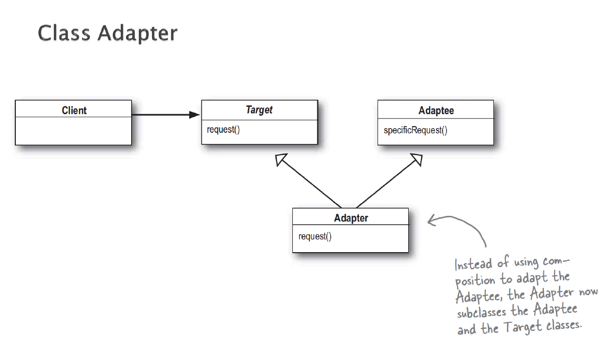
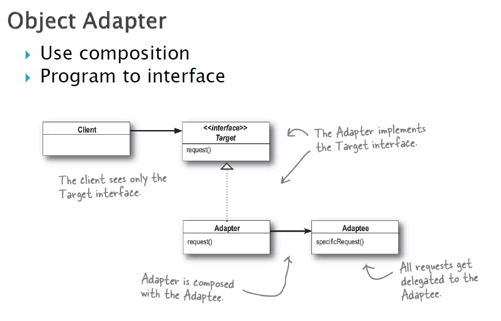

### 1. 패턴이름
- adapter pattern

### 2. 의도
- 별개의 인터페이스를 가지는 클래스들에 대해 그들의 소통 및 상호작용을 가능케하는 공동 객체 생성을 통하여 같이 동작시키기 위함. 

### 3. 문제
- 사용하려고 하는 클래스가 인터페이스 요구사항을 만족하지 못하는 경우

### 4. 솔루션

- class adapter의 경우 상속을 활용하고, object adapter의 경우 구성을 활용함
