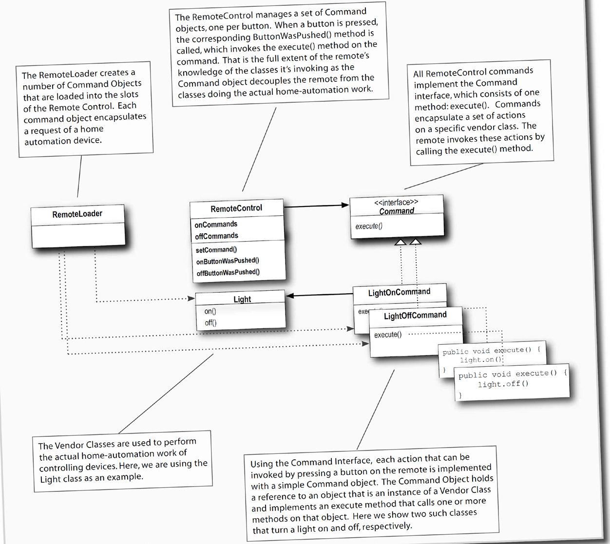
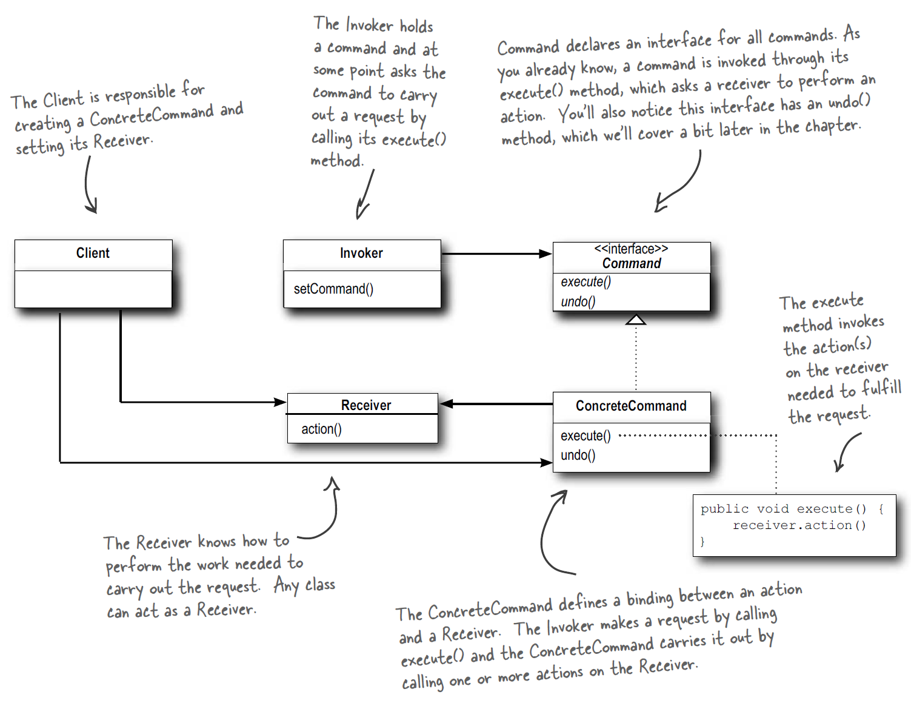

### 1. 패턴이름
- command pattern

### 2. 의도
- 요청을 객체로 캡슐화 한다
- 이는 큐잉 혹은 콜백과 같은 기존의 객체 기반 관계로 요청을 다룰 수 있게 함 (undo 등도 가능케함)

### 3. 문제
(언제쓰는지)
- 다양한 시기에 다양한 순서로 요청이 특정되고, 큐잉 되고, 실행되어야 하는 경우
- 과거 요청 내역이 필요한 경우
- 호출자가 호출을 처리하는 객체와 decouple 되어야 하는 경우

### 4. 솔루션

### 5. 결과
- 해당 패턴을 사용함으로서 발생하는 장단점

### 6. 구현
- 어떻게 구현될 수 있는지