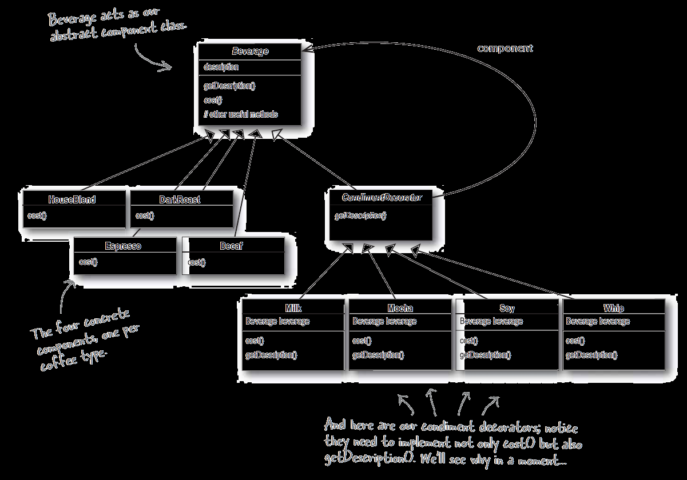
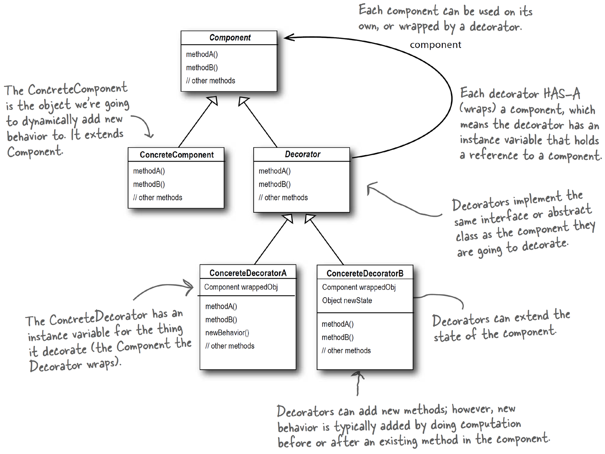

### 1. 패턴이름
decorator pattern

### 2. 의도
* 객체 행위 및 책임을 수정하기 위해 해당 객체에 대한 동적인 감싸기(wrapping)를 지원
* decorator 패턴을 활용하면 기능확장에 대해 subclassing 대신 유연한 대안을 제시함

### 3. 문제
(언제쓰는지)
- 객체의 책임 및 행위가 동적으로 변경가능하다
- 행위를 수정하기 위한 상속이 불가능한 경우
- 구현체를 감싸고 있는 많은 작은 객체 생성이 용인되는 경우

### 4. 솔루션

### 5. 결과
* 단점
  * 많은 수의 작은 클래스들을 생성할 수 있음. (퍼포먼스 문제 가능성)
  * 패턴에 익숙하지 않다면 알아보기 힘들 수 있음