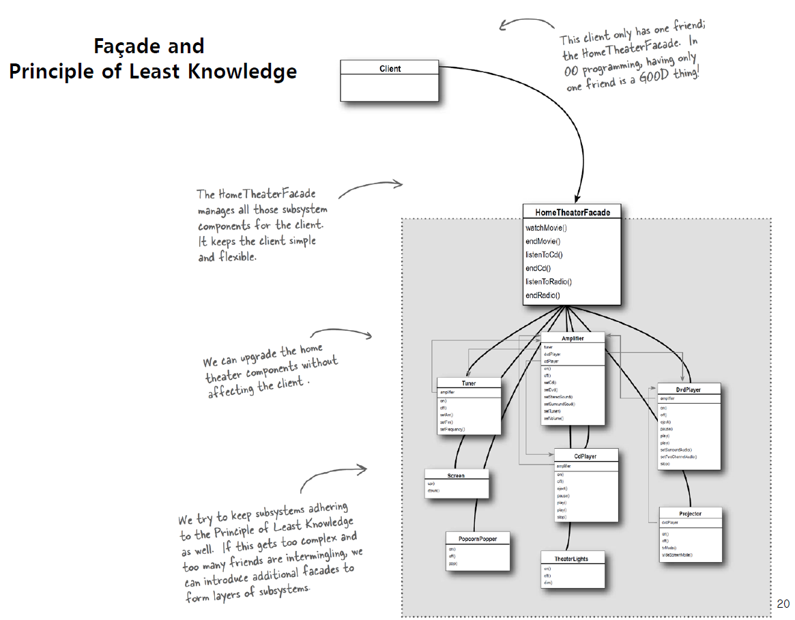
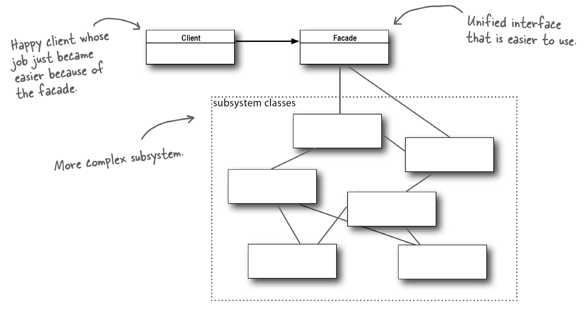

### 1. 패턴이름
- facade pattern

### 2. 의도
- 시스템안에 있는 일련의 인터페이스에 대하여 단일 인터페이스를 제공한다

### 3. 문제
(언제쓰는지)
- 복잡한 시스템에 접근하기 위한 간단한 인터페이스가 필요한경우
- 시스템 구현과 클라이언트 사이에 많은 연관관계가 있는 경우
- 시스템과 그것의 하위 시스템간에 layered 구조가 적용되어 있는 경우

### 4. 솔루션

### 5. 결과
- 장점
  - subsystem의 구현을 클라이언트로 부터 숨길 수 있음
  - subsystem사용을 편리하게 만들어줌
  - 클라이언트와 subsystem 간의 weak coupling을 가능케함
- 참고
  - 숙련된 client가 시스템 내부 클래스들에 직접 접근하는 것을 막는 것은 아님
