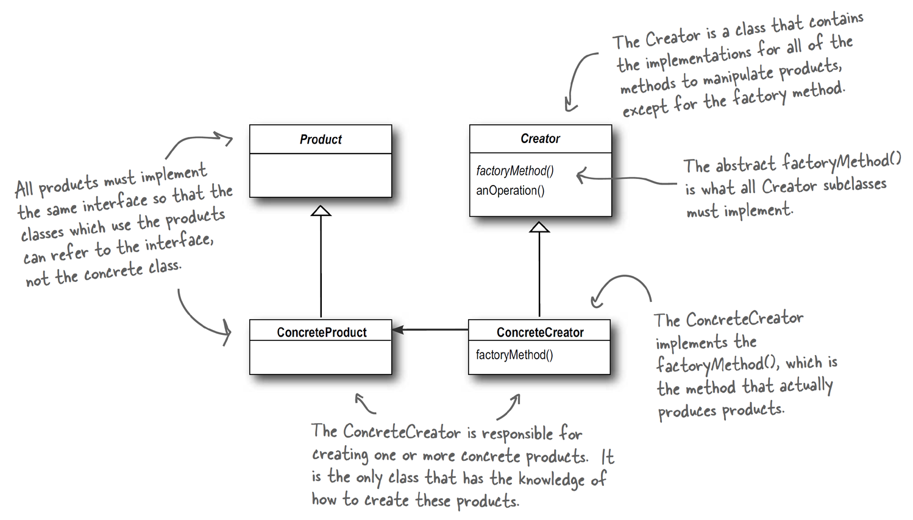
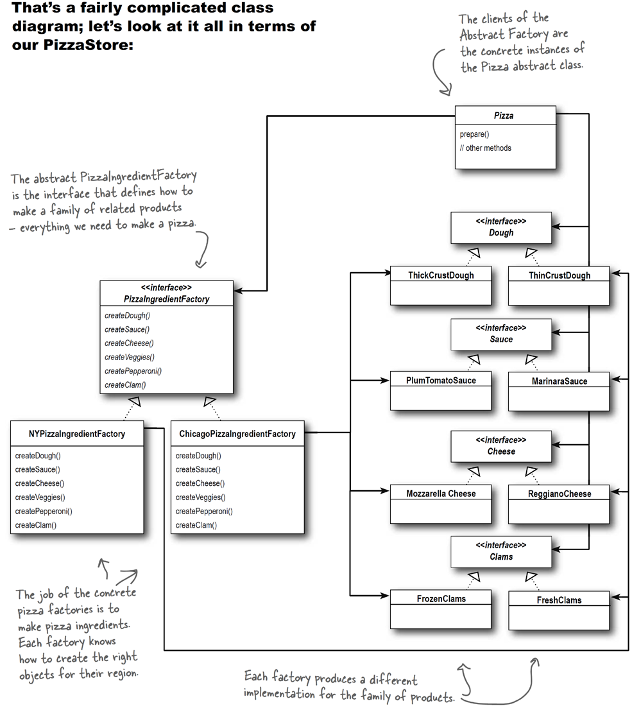
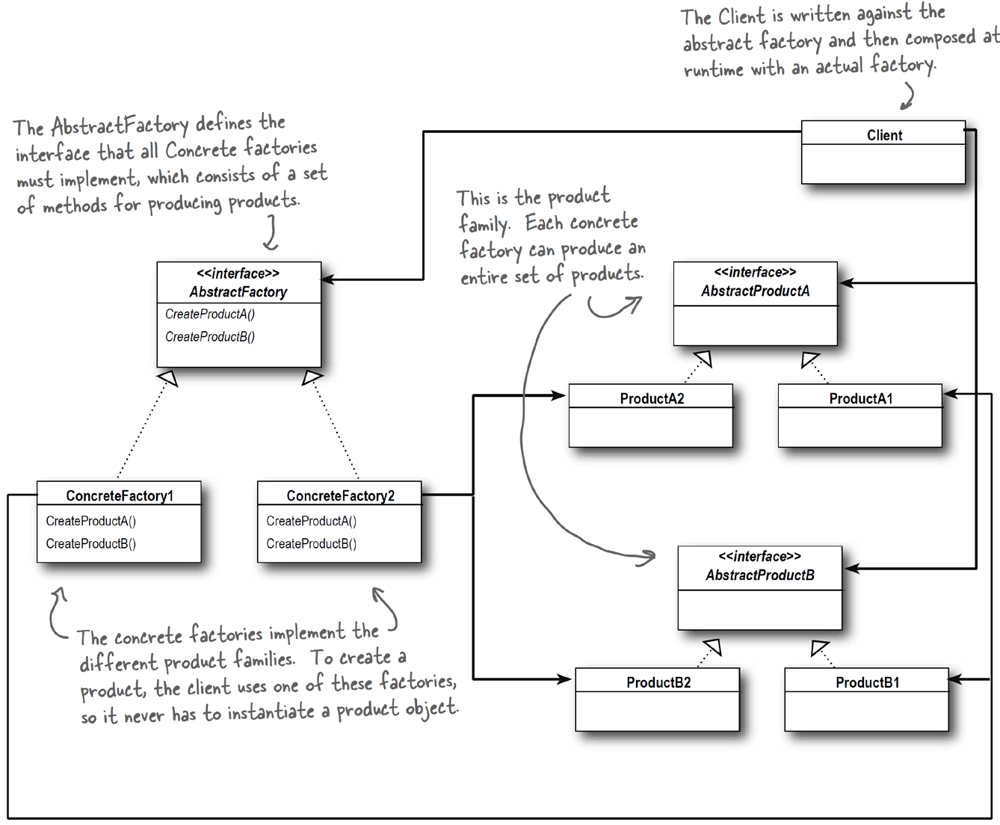

### 1. 패턴이름
- factory method

### 2. 의도
- 객체가 생성되는 방식을 결정하기 위해 '상속'에 초첨을 맞춤
- CF) factory method의 경우 DIP를 이용하는 한가지 사례 (depend upon abstractions)
- creator class는 실제로 어떤 concrete product class가 생성될 지 모른다. 어떤 concrete product class가 생성될 지는 concrete creator 서브 클래스가 결정한다.
- 어떤 concrete product class를 생성할지를 runtime시에 정하는 것은 아니다

### 3. 문제
(언제쓰는지)
- 클래스가 어떤 클래스들의 생성 요구가 있을지 모르는 경우
  - a class will not know what classes it will be required to create
- 하위 클래스가 어떤 객체가 생성되어야 하는지 특정하는 경우
- 부모 클래스가 그들의 자식클래스에게 생성 책임을 미루는 경우

### 4. 솔루션

---

### 1. 패턴이름
- abstract factory

### 2. 의도
- 특정 객체를 생성하기 위해 '객체 생성에 대한 호출을 하나 혹은 그 이상의 구체클래스에 위임'하는 인터페이스를 제공한다.
- abstract factory pattern provides an interface for creating families of

### 3. 문제
(언제쓰는지)
- 객체 생성부분은 해당 부분을 이용하는 시스템과 독립적인 경우
- 시스템이 객체 '군'을 이용하는게 가능한 경우
- 객체'군'은 함께 사용될 수 있는 경우
- 라이브러리가 구현 세부사항을 노출하지 말고 배포되어야 하는 경우
- 구체 클래스들이 그들의 클라이언트와 decouple 되어야 하는 경우

### 4. 솔루션
- 추상 팩토리 패턴은 팩토리 메소드 패턴보다 추상화 단계가 한단계 높은 패턴
- 객체 생성의 책임을 다른 객체 혹은 클래스에 위임/미룬다
- 그렇다면 'factory method' 와 'abstract factory'간의 차이점은 무엇일까?

|factory method|abstract factory|
|------|---|
|문제 해결을 위해 상속을 사용한다|문제 해결을 위해 구성(composition)을 사용한다|

