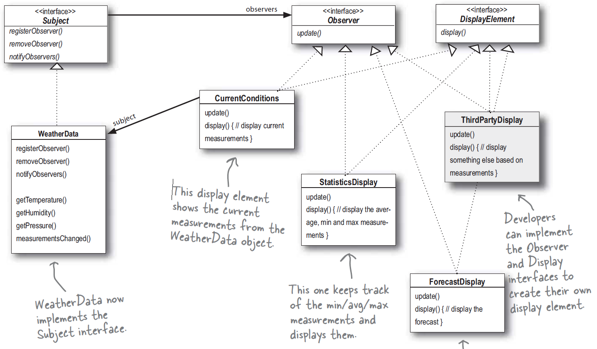
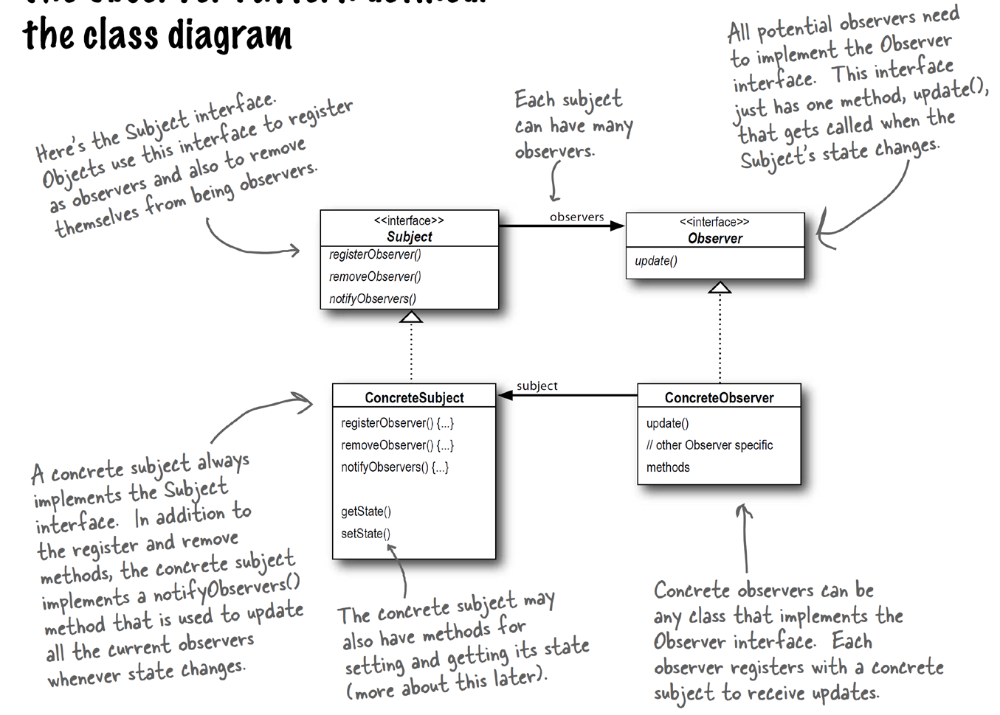

### 1. 패턴이름
- observer pattern

### 2. 의도
- 하나 혹은 그 이상의 객체가 동일 시스템내에 있는 다른 객체의 상태변화에 대하여 통지받도록 하기 위함 (*one-to-many dependency)

### 3. 문제
(언제쓰는지)
- 소통에 대하여 느슨한 연관관계가 필요한 경우
  - 느슨한 연관관계가 있는 경우 객체들은 상호작용할 수 있지만, 서로에 대해 잘 모름
- 하나 또는 그 이상의 객체 상태변화가 다른 객체의 행위를 트리거 해야 하는 경우
- 브로드캐스팅 능력이 요구되는 경우

### 4. 솔루션

