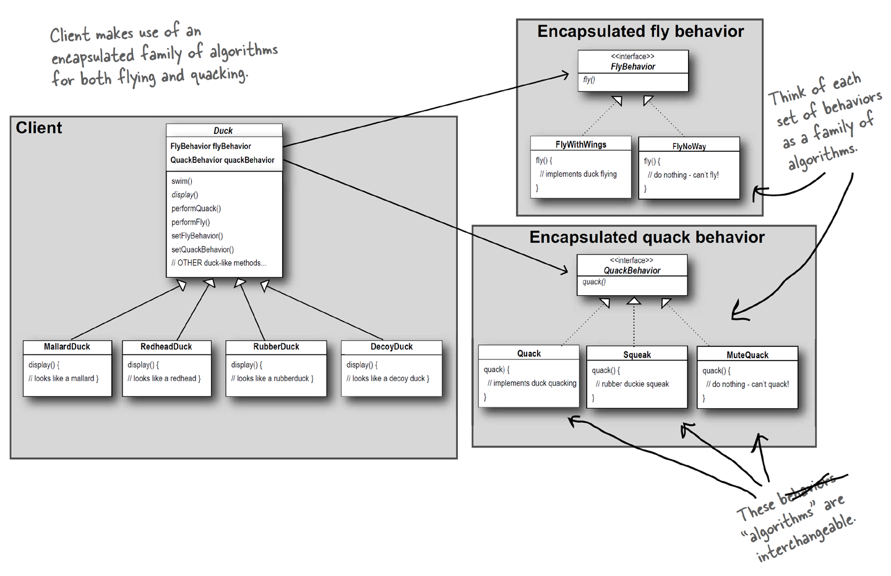
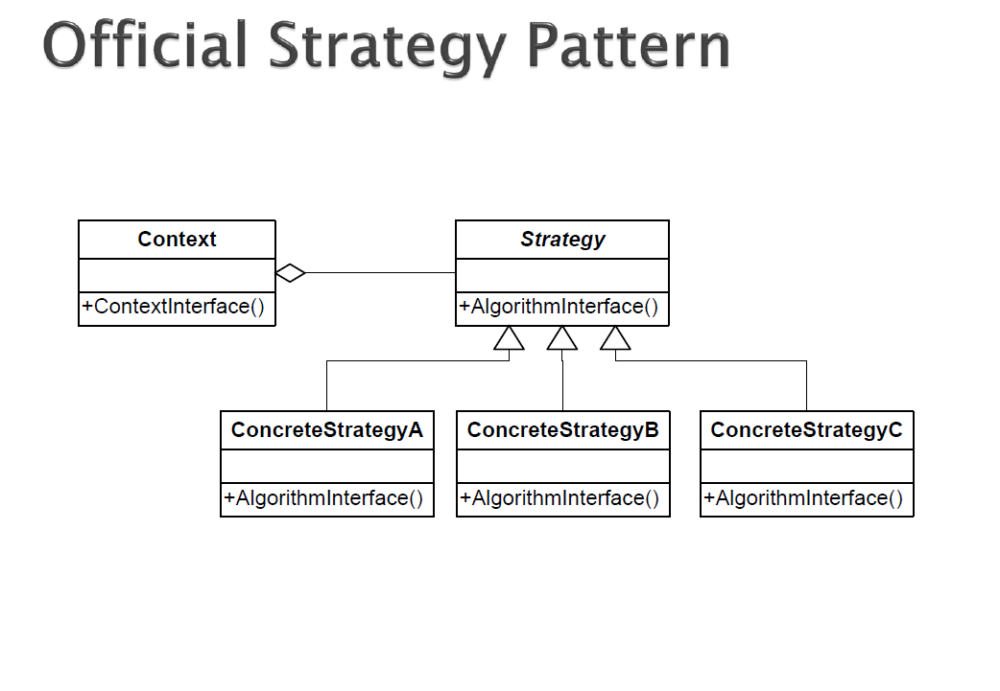

###1. 패턴이름
strategy pattern

###2. 의도
특정한 행위를 하기 위해 서로 교체될 수 있는 일련의 캡슐화된 알고리즘의 집합을 정의

###3. 문제
(언제쓰는지)
- 많은 연관된 클래스들간의 차이가 오로지 그들의 행위일떄
- 많은 버전의 혹은 일부 변형된 알고리즘들이 요구되는 경우
- 호출코드가 노출되어서는 안 되는 데이터에 접근하거나 활용하는 알고리즘
  - \[원문\] algorithms access or utilize data that calling code shouldn't be exposed to
- 클래스의 행위가 런타임에 규정되어야 하는 경우
- 조건문이 복잡하고 유지하기 힘든 경우

###4. 솔루션

###5. 결과

참고. Head First Design Patterns